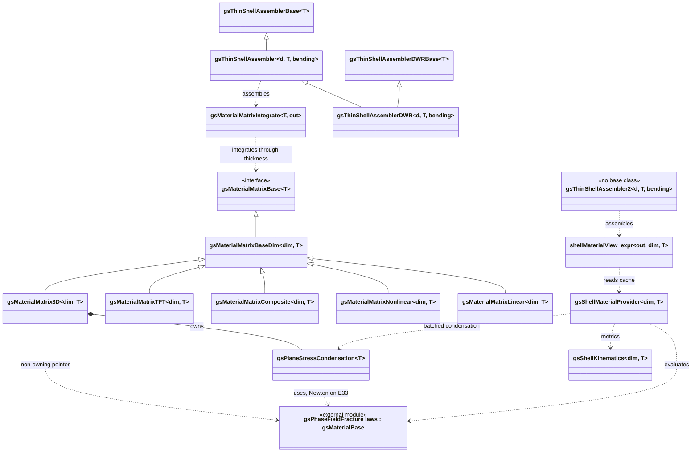

# gsKLShell

Module for the isogeometric Kirchhoff-Love shell element. The module is based on `gismo`'s Expression Assembler `gsExprAssembler`.

|CMake flags|```-DGISMO_OPTIONAL="<other submodules>;gsKLShell"```|
|--:|---|
|License||
|DOI|[](https://doi.org/10.5281/zenodo.15167503)|
|OS support|Linux, Windows, macOS|
|Build status|[](https://github.com/gismo/gsKLShell/actions/workflows/ci.yml)|
|Developers/maintainers| [](https://github.com/hverhelst) [](https://github.com/Crazy-Rich-Meghan)|

#### Dependencies
No dependencies

#### Installation
```
cd path/to/build/dir
cmake . -DGISMO_OPTIONAL="<other submodules>;gsKLShell"
make
```

***

#### Overview of the `gsKLShell` module
`gsThinShellAssembler`
* Linear and Non-Linear kinematics
* Follower pressures and elastic foundation stiffness
* Supports B-spline, NURBS, H-Spline and THB-Spline bases
* Membrane or shell elements via template parameters

`gsThinShellAssemblerDWR`
* Error estimation via the Dual-Weighted Residual method

`gsMaterialMatrixBase` and derivatives
* Linear materials via Saint-Venant Kirchhoff model
* (In)Compressible non-linear materials: Neo-Hookean, Mooney-Rivlin and Ogden materials.
* Direct implementation for other material models possible
* Generalized formulations given the derivatives of the Strain Energy Density Function w.r.t components of the deformation tensor possible
* Stretch-based implementations given the derivatives of the Strain Energy Density Function w.r.t. the stretches
* Material and compressibility flags via template parameters

`gsThinShellAssembler2` and `gsShellMaterialProvider`
* Alternative assembly pipeline that evaluates ONE material law per element into
  a cache and reads the six shell moments (`MatrixA`..`MatrixD`, `VectorN`,
  `VectorM`) from it as zero-copy `shellMaterialView` expressions
* `gsShellKinematics` is the standalone, stateless metric engine (it reads an
  injected `gsMapData`); `gsPlaneStressCondensation` condenses a 3D law to plane
  stress by a Newton iteration on `E33`

`gsMaterialMatrix3D`
* Legacy-compatible ADAPTER that wraps a single 3D `gsMaterialBase` law from
  `gsPhaseFieldFracture` and presents it as a `gsMaterialMatrixBase`, so the
  untouched `gsMaterialMatrixIntegrate` / `gsThinShellAssembler` can drive it

> **Build constraint.** `gsMaterialMatrix3D`, `gsPlaneStressCondensation`,
> `gsShellMaterialProvider`, `gsShellMaterialExpr` and `gsThinShellAssembler2`
> are compiled only under `#ifdef gsPhaseFieldFracture_ENABLED`, i.e. only when
> the `gsPhaseFieldFracture` submodule is enabled as well. Without it, the module
> builds with the legacy material matrices alone.

##### Architecture

*Plain-text summary of the diagram below:* `gsMaterialMatrixBase<T>` is the shell
constitutive interface; `gsMaterialMatrixBaseDim<dim,T>` adds the shell metric
machinery, and the four legacy material matrices plus the `gsMaterialMatrix3D`
adapter derive from it. Two independent routes bring a `gsPhaseFieldFracture`
3D law into a shell: the ADAPTER route (`gsMaterialMatrix3D` ->
`gsMaterialMatrixIntegrate` -> `gsThinShellAssembler`) and the PROVIDER route
(`gsShellMaterialProvider` -> `shellMaterialView` expressions ->
`gsThinShellAssembler2`). Both go through `gsPlaneStressCondensation`, which
*uses* a `gsMaterialBase<T>` rather than deriving from it.
`gsThinShellAssembler2` has no base class -- it is a parallel pipeline, not a
`gsThinShellAssemblerBase` subclass.



Read left to right, the point of the unification is that **one**
`gsPhaseFieldFracture` law reaches the solid assembler of that module and both
shell pipelines here, without being reimplemented for either.

#### Use of the `gsKLShell` module
The `gsKLShell` module consists of the classes
* `gsThinShellAssembler`: class that resolves the kinematics of the Kirchhoff-Love shells
* `gsThinShellAssemblerDWR`: same as the above, but contains extra functions for the Dual Weighted Residual (DWR) method
* `gsMaterialMatrixLinear`: class that handles the linear constitutive relations of the shells.
* `gsMaterialMatrixNonlinear`: class that handles the non-linear constitutive relations of the shells.
* `gsMaterialMatrixComposite`: class that handles constitutive relations for linear composites.
* `gsMaterialMatrixTFT`: class that handles tension-field-theory-based constitutive models for membranes.

See the doxygen manuals for more information about the classes. (**to do: add link**)

To use the `gsKLShell` module, one should always define a `gsMaterialMatrixBase` and a `gsThinShellAssembler`. The `gsMaterialMatrixBase` object is used to compute the constitutive relations in the `gsThinShellAssembler` and should therefore be defined upon initialisation of this class.

Additionally, the geometry and the deformed geometry (both `gsMultiPatch`) together with a basis (`gsMultiBasis`) and the boundary conditions (`gsBoundaryConditions`) and a surface force (`gsFunctionExpression`) should be provided in the definition of the class.

The template parameters of the class are the dimension of the geometry (`dim`) which is 2D (planar) or 3D (surface) and a flag for the computation of bending stiffness term (`bending`) which is only relevant if `dim==3`. Other options that can be set are follower pressures (`setPressure`), elastic foundation stiffness (`setFoundation`) and point loads (`setPointLoads`).
